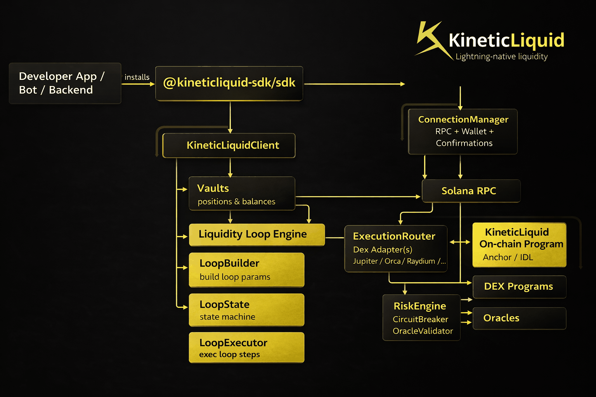

[README.md](https://github.com/user-attachments/files/24412604/README.md)
<p align="center">
  
</p>

<h1 align="center">KineticLiquid SDK</h1>

<p align="center">
  <b>Production-grade, Solana-native TypeScript SDK for deterministic, risk-aware liquidity execution & loop automation.</b>
</p>

<p align="center">
  <a href="https://www.npmjs.com/package/@kineticliquid-sdk/sdk">
    
  </a>
  <a href="https://www.npmjs.com/package/@kineticliquid-sdk/sdk">
    
  </a>
  <a href="https://github.com/kineticliquid/KineticLiquid">
    
  </a>
  
  
</p>

---

## Install

```bash
npm i @kineticliquid-sdk/sdk
```

## What is KineticLiquid?

KineticLiquid is a **Solana-native liquidity execution + loop engine** designed for **deterministic routing**, **typed failure modes**, and **risk-first automation**.

This SDK is infrastructure software:
- explicit error handling
- deterministic routing decisions
- audit-friendly abstractions
- non-custodial signing (you control the wallet)

---

## Architecture (Flow)

<p align="center">
  
</p>

---

## Design Principles

- **No hidden transactions**: the SDK never stores private keys and never signs without an explicit `wallet.signTransaction(...)`.
- **Deterministic execution**: routing selection and risk checks are deterministic for a given input set.
- **Fail-closed risk**: circuit breakers halt execution immediately.
- **Typed, explicit errors**: consumer code can reliably branch on error classes.
- **IDL-driven interface**: instruction building and account decoding use Anchor-compatible IDL.

---

## Quickstart

```ts
import { Connection, PublicKey } from '@solana/web3.js';
import { KineticLiquidClient } from '@kineticliquid-sdk/sdk';

const connection = new Connection(process.env.RPC_URL!, 'confirmed');
const programId = new PublicKey(process.env.KINETICLIQUID_PROGRAM_ID!);

// wallet must implement: publicKey + signTransaction
const client = new KineticLiquidClient({
  connection,
  wallet,
  environment: 'mainnet',
  programId,
});
```

---

## Vaults

```ts
const vault = await client.vaults.create({
  owner: wallet.publicKey,
  assetMint: new PublicKey(process.env.USDC_MINT!),
  maxOracleDeviationBps: 200,
  maxVolatilityBps: 500,
  maxSlippageBps: 100,
});
```

---

## Loops

```ts
const loop = client.loops.build({
  vault,
  maxRisk: 0.05,
  rebalanceInterval: 3600,
  oracle,
});

await loop.execute({
  minOutAmount: 0n,
});
```

---

## Observability

`KineticLiquidClient` emits structured events:

- `vault:health`
- `loop:state`
- `execution:record`

Use these for logs/metrics and to ensure there are no silent failures.

---

## Testing

Unit tests:

```bash
npm run test:unit
```

Integration tests (need real RPC + deployed program):

```bash
export KINETICLIQUID_RPC_URL=http://127.0.0.1:8899
export KINETICLIQUID_PROGRAM_ID=...
INTEGRATION=1 npm run test:integration
```

---

## Links

- npm: https://www.npmjs.com/package/@kineticliquid-sdk/sdk
- GitHub: https://github.com/kineticliquid/KineticLiquid

---

## Legal Disclaimer

This SDK is provided “as is”, without warranty of any kind. You are responsible for validating correctness, security properties, and production suitability for your deployment and jurisdiction.
